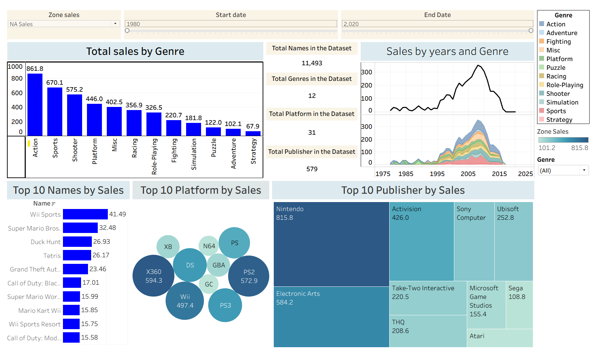

# 🎮 Video Game Sales Analysis Dashboard (Tableau)

This interactive Tableau dashboard visualizes global video game sales data, offering insights into platform trends, top-selling genres, and publisher performance over time.

---

## 📊 Dashboard Features

### 1. **Total Sales by Genre**
- A vertical bar chart displaying total global sales across genres such as Action, Sports, Shooter, etc.
- Action games dominate with the highest cumulative sales.

### 2. **Top 10 Games by Sales**
- Horizontal bar chart showing the most sold games globally.
- Includes classics like *Wii Sports*, *Super Mario Bros.*, *Duck Hunt*, etc.

### 3. **Top 10 Platforms by Sales**
- Bubble chart representing total sales per gaming platform (e.g., PS2, X360, Wii).
- Size indicates total sales volume.

### 4. **Top 10 Publishers by Sales**
- Tree map visual showing top game publishers based on global sales.
- Nintendo and Electronic Arts lead the chart.

### 5. **Sales Over Time by Genre**
- Area chart showing the evolution of sales trends across genres from 1980 to 2020.
- Interactive filtering by genre and year.

### 6. **Dataset KPIs**
- Total games, genres, platforms, and publishers included in the dataset.

---

## 🧰 Tools & Technologies

- **Tableau Desktop** for dashboard development
- **CSV Dataset** from Kaggle or other public sources
- Filters and calculated fields for dynamic interaction

---

## 📁 Dataset Info

- Contains video game records with fields like `Name`, `Platform`, `Genre`, `Publisher`, `Year`, `Global_Sales`, etc.
- Time range: ~1980–2020
- Zone sales breakdown: NA, EU, JP, Others

---

## 📂 File Structure
# 🎮 Video Game Sales Analysis Dashboard (Tableau)

This interactive Tableau dashboard visualizes global video game sales data, offering insights into platform trends, top-selling genres, and publisher performance over time.

---

## 📊 Dashboard Features

### 1. **Total Sales by Genre**
- A vertical bar chart displaying total global sales across genres such as Action, Sports, Shooter, etc.
- Action games dominate with the highest cumulative sales.

### 2. **Top 10 Games by Sales**
- Horizontal bar chart showing the most sold games globally.
- Includes classics like *Wii Sports*, *Super Mario Bros.*, *Duck Hunt*, etc.

### 3. **Top 10 Platforms by Sales**
- Bubble chart representing total sales per gaming platform (e.g., PS2, X360, Wii).
- Size indicates total sales volume.

### 4. **Top 10 Publishers by Sales**
- Tree map visual showing top game publishers based on global sales.
- Nintendo and Electronic Arts lead the chart.

### 5. **Sales Over Time by Genre**
- Area chart showing the evolution of sales trends across genres from 1980 to 2020.
- Interactive filtering by genre and year.

### 6. **Dataset KPIs**
- Total games, genres, platforms, and publishers included in the dataset.

---

## 🧰 Tools & Technologies

- **Tableau Desktop** for dashboard development
- **CSV Dataset** from Kaggle or other public sources
- Filters and calculated fields for dynamic interaction

---

## 📁 Dataset Info

- Contains video game records with fields like `Name`, `Platform`, `Genre`, `Publisher`, `Year`, `Global_Sales`, etc.
- Time range: ~1980–2020
- Zone sales breakdown: NA, EU, JP, Others

---

## 📂 File Structure
# 🎮 Video Game Sales Analysis Dashboard (Tableau)

This interactive Tableau dashboard visualizes global video game sales data, offering insights into platform trends, top-selling genres, and publisher performance over time.

---

## 📊 Dashboard Features

### 1. **Total Sales by Genre**
- A vertical bar chart displaying total global sales across genres such as Action, Sports, Shooter, etc.
- Action games dominate with the highest cumulative sales.

### 2. **Top 10 Games by Sales**
- Horizontal bar chart showing the most sold games globally.
- Includes classics like *Wii Sports*, *Super Mario Bros.*, *Duck Hunt*, etc.

### 3. **Top 10 Platforms by Sales**
- Bubble chart representing total sales per gaming platform (e.g., PS2, X360, Wii).
- Size indicates total sales volume.

### 4. **Top 10 Publishers by Sales**
- Tree map visual showing top game publishers based on global sales.
- Nintendo and Electronic Arts lead the chart.

### 5. **Sales Over Time by Genre**
- Area chart showing the evolution of sales trends across genres from 1980 to 2020.
- Interactive filtering by genre and year.

### 6. **Dataset KPIs**
- Total games, genres, platforms, and publishers included in the dataset.

---

## 🧰 Tools & Technologies

- **Tableau Desktop** for dashboard development
- **CSV Dataset** from Kaggle or other public sources
- Filters and calculated fields for dynamic interaction

---

## 📁 Dataset Info

- Contains video game records with fields like `Name`, `Platform`, `Genre`, `Publisher`, `Year`, `Global_Sales`, etc.
- Time range: ~1980–2020
- Zone sales breakdown: NA, EU, JP, Others

---

## 📂 File Structure

📦video-game-sales-dashboard/
┣ 📊 Tableau Dashboard (Packaged Workbook / Screenshot)
┣ 📈 Dataset (CSV)
┣ 🖼️ b0142719-337c-42c8-a36a-80cdfea4b44e.png
┗ 📄 README.md
